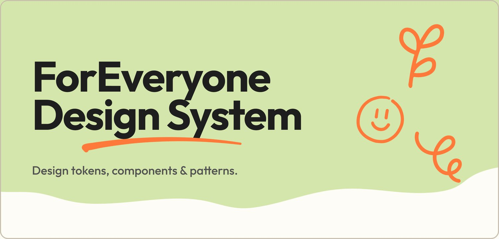

# ForEveryone Berlin Design System



Token-driven design system for [foreveryone.berlin](https://foreveryone.berlin/), an open, inclusive community space in Berlin. Design tokens, generated CSS, and a Next.js prototype that pulls it all together.

Live prototype: **[design.foreveryone.berlin](https://design.foreveryone.berlin)**


## Tech stack

- **Tokens:** W3C DTCG JSON (`tokens/*.json`) with `$value`, `$type`, `$description`.
- **Build:** Node script `scripts/build-css.js` generates `css/custom-properties.css`.
- **CSS:** Authored layers in `css/*.css` (variables only, no raw values).
- **Prototype:** Next.js 15 + TypeScript (App Router) in `prototype/`.
- **Hosting:** Vercel at `design.foreveryone.berlin` (legacy `fe-design-system.vercel.app` 301-redirects there).
- **Production target:** WordPress + Elementor Pro on `foreveryone.berlin` (global colors, global fonts, custom CSS).
- **CI:** GitHub Actions for token build + test + prototype build, and auto-release on `v*.*.*` tag.

## Quick start

```bash
# Build CSS custom properties from tokens
node scripts/build-css.js

# Run the prototype locally
cd prototype && npm install && npm run dev
# → http://localhost:3000
```

Root `package.json` script aliases: `npm run build`, `npm test`, `npm run prototype:dev`, `npm run prototype:build`, `npm run prototype:lint`.

## How tokens work

1. Token values live in [`tokens/*.json`](tokens/) (W3C DTCG shape: `$value`, `$type`, `$description`).
2. [`scripts/build-css.js`](scripts/build-css.js) reads [`tokens/index.json`](tokens/index.json) imports.
3. The script generates [`css/custom-properties.css`](css/custom-properties.css) (the `:root` block). **Do not hand-edit it.**
4. Authored layers in [`css/*.css`](css/) consume variables via `var(--…)`.
5. The marketing site and the Next.js prototype both read from the same generated file.

`scripts/build-css.test.js` validates the DTCG shape and smoke-checks the generated CSS.

## Repository layout

```text
foreveryone-design-system/
├── tokens/          # Source-of-truth token JSON (DTCG)
├── css/             # Generated + authored CSS
├── scripts/         # Build, test, and PR helpers
├── prototype/       # Next.js preview app
├── elementor/       # Global colors / fonts / custom CSS for the marketing site
├── figma/           # Tokens Studio sync notes
├── docs/            # Guides, ADRs, agent contracts
│   ├── AGENTS.md    #   ↳ full docs index + domain rules
│   └── skills/      #   ↳ repeatable workflows (tokens, releases)
├── AGENTS.md        # Repo-root mirror of docs/AGENTS.md
├── CLAUDE.md        # Claude Code session entry
└── CHANGELOG.md
```

## Integrations

- **Figma + Tokens Studio:** [`figma/sync-guide.md`](figma/sync-guide.md) and [`figma/token-export-instructions.md`](figma/token-export-instructions.md).
- **Marketing site:** Global colors [`elementor/global-colors.md`](elementor/global-colors.md), global fonts [`elementor/global-fonts.md`](elementor/global-fonts.md), CSS setup [`elementor/custom-css-setup.md`](elementor/custom-css-setup.md). Reference docs: [`docs/official-references.md`](docs/official-references.md).
- **Visual styles** (icons, blobs, photography, category icon set): [`docs/visual-styles.md`](docs/visual-styles.md).
- **Logo usage** (X measurement, safe zone, min sizes, white-on-orange exception): [`docs/logo-usage.md`](docs/logo-usage.md).
- **Color audit** (2026 brand-guide alignment + approved bg ⇄ text combinations): [`docs/color-audit-2026.md`](docs/color-audit-2026.md).

## Git workflow

- `main` is the default branch (protected, release-ready). `develop` is the integration branch.
- Branch from `develop` using `feature/*`, `fix/*`, `docs/*`, `chore/*`.
- Use Conventional Commits.
- PRs use [`.github/PULL_REQUEST_TEMPLATE.md`](.github/PULL_REQUEST_TEMPLATE.md).
- Solo flow: `bash scripts/pr-and-merge.sh` pushes the current branch, opens a PR, and merges it.
- Tag `main` with `vX.Y.Z` at release; see [`docs/skills/release.md`](docs/skills/release.md).

## AI coding assistants

- **Canonical context:** [`docs/AGENTS.md`](docs/AGENTS.md) (full documentation index + domain rules).
- **Repo-root mirror:** [`AGENTS.md`](AGENTS.md) for tools that only auto-load root-level `AGENTS.md`.
- **Cursor:** [`.cursor/AGENTS.md`](.cursor/AGENTS.md) + path-scoped rules in [`.cursor/rules/`](.cursor/rules/).
- **Claude Code:** [`CLAUDE.md`](CLAUDE.md) + path-scoped rules in [`.claude/rules/`](.claude/rules/).
- **Agent contract + runtime policy:** [`docs/agents/`](docs/agents/).
- **Repeatable workflows:** [`docs/skills/`](docs/skills/).

## Contributing

See [`docs/contributing.md`](docs/contributing.md) for workflow, commit conventions, and PR expectations.

## Acknowledgements

This design system is a community effort. Built with care by the people who make ForEveryone Berlin what it is: a warm, open space where everyone belongs.

With thanks to Didem, Pedram, Rie, and Angelina.

## License

Dual-licensed in a single [LICENSE](LICENSE) file:

- **Software** (`scripts/`, `prototype/`): **MIT**.
- **Design system** (`tokens/`, `css/`, `figma/`, `elementor/`, `docs/`, agent docs, `.claude/` and `.cursor/` rules): **CC BY-NC 4.0** ([summary](https://creativecommons.org/licenses/by-nc/4.0/)).

## Changelog

Full history in [`CHANGELOG.md`](CHANGELOG.md). GitHub Releases for each tag mirror the changelog entry.
