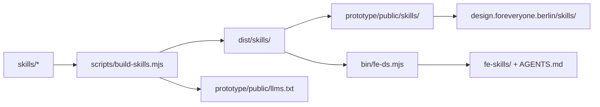

# Support consumer AI skills (v1)

Shipped plan for installable consumer AI skills, adapted from the bullframe.css skills pipeline.

## Checklist

- [x] Add `skills/_shared/conventions.md`, `skills/fe-core/SKILL.md`, `skills/fe-redesign/SKILL.md`
- [x] Add `scripts/build-skills.mjs`; wire into `npm run build`; commit `dist/skills` + sync to `prototype/public/skills` (+ `llms.txt`)
- [x] Exempt `/skills/*` and `/llms.txt` from `Content-Signal: ai-input=no` and from `proxy.ts` bot 403
- [x] Add lean prototype `/ai-skills` page + nav/search/smoke/a11y wiring; short home or governance pointer
- [x] New **AI** nav group for `/ai-skills`
- [x] Add `bin/fe-ds.mjs` (list/path/install); `package.json` bin; LICENSE path for `bin/`
- [x] CI drift check for skills trees; LICENSE path list for `skills/` and `bin/`
- [x] Update README (flat, no bloat), `docs/ai-skills.md` + AGENTS/llms mirrors, CHANGELOG `[Unreleased]` (no premature version bump)
- [x] Frontmatter + build output + CLI `--dry-run` checks wired into `npm test`

## Verified assumptions

| Assumption | Result |
| --- | --- |
| No npm publish | Confirmed. Root and `prototype/` are `private: true`; [docs/AGENTS.md](../AGENTS.md) states there is no `npm publish` step. |
| Install = clone + CLI | Correct primary path. Consumers already adopt via repo paths (`llms.txt`, `spec/`), not a registry. |
| Site can host `/skills/` | Vercel root is `prototype/` ([docs/prototype-deploy.md](../prototype-deploy.md)), so files must live under `prototype/public/skills/` and be **committed** (Vercel runs `next build` only, not root `npm run build`). |
| Site is agent-readable today | **False without fixes.** Live site sends `Content-Signal: ai-input=no` on all paths ([prototype/next.config.ts](../../prototype/next.config.ts)); [prototype/proxy.ts](../../prototype/proxy.ts) 403s many AI crawler UAs. `https://design.foreveryone.berlin/llms.txt` is **404** (root `llms.txt` is not in `prototype/public/`). Claiming bullframe-style public URLs requires exemptions + copying `llms.txt` into public. |
| Machine surface | `spec/tokens.json` already exists (156 tokens). ~135 `.fe-*` selectors in CSS; no class `api.json` yet. Reuse tokens for v1. |
| Dual built trees | Same as bullframe `dist/skills` + docs public sync. CI already drift-checks `css/custom-properties.css`; extend that pattern to both skills trees. |
| License | Brand/agent material is CC BY-NC; `scripts/` and `prototype/` are MIT. New `skills/` → CC BY-NC list; new `bin/` → MIT list in [LICENSE](../../LICENSE). |
| Name collision | `docs/skills/` = maintainer workflows; `.claude/skills/` = project tools. Consumer skills go in root `skills/`. Keep all three. |

## Shape (bullframe, adapted)



Primary install: from a clone, `node bin/fe-ds.mjs skills install` (zero network, zero API key). Site URLs are the secondary discovery path for agents that only have the hostname.

## 1. Author under `skills/`

| Path | Role |
| --- | --- |
| [skills/_shared/conventions.md](../../skills/_shared/conventions.md) | Hard rules from `llms.txt` / `spec/principles.md`, with `<!-- agents:start -->` … `<!-- agents:end -->` for the managed AGENTS block |
| [skills/fe-core/SKILL.md](../../skills/fe-core/SKILL.md) | Consume the system: import CSS vars, resolve tokens, use `fe-*`, never invent hex/fonts |
| [skills/fe-redesign/SKILL.md](../../skills/fe-redesign/SKILL.md) | Restyle an app; fold [docs/agents/redesign-from-this-system.md](../agents/redesign-from-this-system.md); `requires: [fe-core]` |

Frontmatter:

```yaml
---
name: fe-core
description: …
foreveryone: '>=1.8.0 <2.0.0'
requires: []
docs: ['llms.txt', 'spec/principles.md', 'spec/tokens.json']
---
```

No HTML fixtures, no Elementor skill, no Anthropic eval.

## 2. Build: [scripts/build-skills.mjs](../../scripts/build-skills.mjs)

- Copy `skills/**` → `dist/skills/`
- Write `index.json` (package name/version, docs base `https://design.foreveryone.berlin`, skill manifest)
- Write `AGENTS.foreveryone.md` from the marked conventions section + skill index
- Copy [spec/tokens.json](../../spec/tokens.json) → `dist/skills/tokens.json`
- Sync `dist/skills/` → `prototype/public/skills/`
- Copy root `llms.txt` → `prototype/public/llms.txt` (fixes the live 404)

Scripts in root [package.json](../../package.json):

- `skills:build` → `node scripts/build-skills.mjs`
- `build` → CSS + spec + `skills:build`

Commit both `dist/skills/` and `prototype/public/skills/` (and `prototype/public/llms.txt`).

## 3. Site: payload + access + visible page

### Static payload (for agents)

- Sync `dist/skills/` → `prototype/public/skills/`
- Copy root `llms.txt` → `prototype/public/llms.txt`
- [prototype/next.config.ts](../../prototype/next.config.ts): for `/skills/:path*` and `/llms.txt`, omit `Content-Signal: ai-input=no` (keep `noindex` if desired)
- [prototype/proxy.ts](../../prototype/proxy.ts): skip the bot 403 for those same paths

### Human-facing page (prototype UI)

Add a lean Guidance page at [prototype/app/ai-skills/page.tsx](../../prototype/app/ai-skills/page.tsx), same tone as [docs/ai-skills.md](../ai-skills.md):

- What the skills are (`fe-core`, `fe-redesign`)
- Install from clone: `node bin/fe-ds.mjs skills install`
- Links to `/skills/index.json`, `/llms.txt`, and the GitHub docs page
- No long tutorial; one screen, one job

Wire it into the IA with a dedicated nav group:

- [prototype/app/_components/nav-sections.ts](../../prototype/app/_components/nav-sections.ts): new **AI** group with `/ai-skills`
- [prototype/app/_components/search-index.ts](../../prototype/app/_components/search-index.ts) and page-headings if present
- [prototype/tests/smoke.spec.ts](../../prototype/tests/smoke.spec.ts) and [prototype/tests/a11y.spec.ts](../../prototype/tests/a11y.spec.ts) route lists
- One short pointer from the home overview or Governance “source of truth” section (not both; prefer home overview card if it stays balanced)

## 4. CLI: [bin/fe-ds.mjs](../../bin/fe-ds.mjs)

Port bullframe’s CLI (local copy only):

- `node bin/fe-ds.mjs skills list | path | install`
- Writes `fe-skills/` + managed `<!-- foreveryone:skills:start -->` … `end -->` in consumer `AGENTS.md`
- Auto-detect `.claude` / `.cursor` / `.agents`; support `--target`, `--dir`, `--dry-run`, `--force`
- Reads payload from `dist/skills/` relative to package root

Root `package.json`: `"bin": { "fe-ds": "bin/fe-ds.mjs" }`, remain `private: true`.

## 5. CI and license

- Extend the tokens CI job: run `npm run skills:build`, fail if `dist/skills/` or `prototype/public/skills/` or `prototype/public/llms.txt` drift (same pattern as `css/custom-properties.css`)
- Wire a small check into `npm test` (frontmatter required keys; build artifacts present; CLI `--dry-run` exits 0)
- [LICENSE](../../LICENSE): add `skills/` under CC BY-NC; add `bin/` under MIT

## 6. README, docs, changelog (required)

### README (replace, do not grow)

Touch only the existing AI / agents bits in [README.md](../../README.md). Swap or tighten lines in **AI coding assistants** and the **For AI agents** consumer bullet so they mention installable skills and point at `docs/ai-skills.md`. Do not add a new top-level section, table, or long install walkthrough. Net README line count stays flat or shrinks.

### Docs

- New [docs/ai-skills.md](../ai-skills.md): clone install first, then site URLs; distinguish consumer `skills/` vs maintainer [docs/skills/](../skills/) vs `.claude/skills/optimize-prototype`
- Link it from [docs/getting-started.md](../getting-started.md) (one short bullet or sentence) and from the docs index in [docs/AGENTS.md](../AGENTS.md)
- [llms.txt](../../llms.txt): add an **Agent skills** section (install command + `/skills/index.json`)
- Command / index pins in root [AGENTS.md](../../AGENTS.md), [CLAUDE.md](../../CLAUDE.md), [.cursor/AGENTS.md](../../.cursor/AGENTS.md) only where `skills:build` / `fe-ds` belong in the commands table
- Point [docs/agents/redesign-from-this-system.md](../agents/redesign-from-this-system.md) at the `fe-redesign` skill as the installable form of that workflow

### Changelog

- [CHANGELOG.md](../../CHANGELOG.md) under `## [Unreleased]`: one plain-language bullet for consumer AI skills (install CLI + site payload). No file-path dump; match the changelog style at the top of that file.

## Defaults locked for v1

- Distribution: **clone CLI first**, site mirror second; **no npm publish**
- Skills: **`fe-core` + `fe-redesign` only**
- Machine surface: **`tokens.json` only** (no `fe-*` class api.json)
- Site: **static `/skills/` + `/llms.txt`**, access exemptions, and a **`/ai-skills` page** under a new **AI** nav group in the prototype
- Docs surface: **README updated in place (no bloat)**, full how-to in `docs/ai-skills.md`, **CHANGELOG [Unreleased]** bullet, prototype `/ai-skills` page
- Maintainer `optimize-prototype` and `docs/skills/*` unchanged in role
